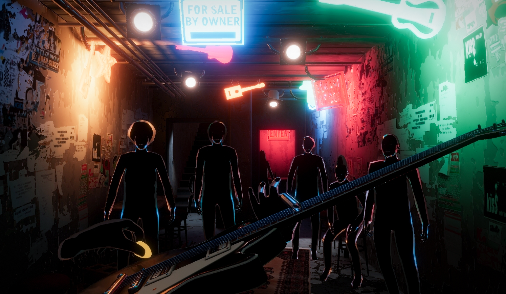
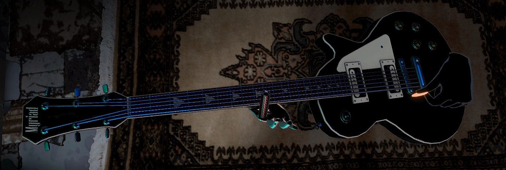

# Shoegazer
## A VR Guitar Jam Session Project 

Jump inside a nasty dive bar and jam out to the beat of your favourite songs on a lead guitar. Fully Open-Source Unity 2019.2 VR project optimized for both Desktop VR and Oculus Quest. This is largely an experiment to see how far along I could get with a weekend's amount of work - I took an hour friday at my job to prototype the basic guitar mechanics but then the other 10 hours I spent doing look dev and prototyping at home.

### Control Scheme

Right-handed controls are probably borked but my code, as messy as it is, still has enough of a left-hand-right-hand framework going on that adding full right hand support shouldn't be too hard. Might get around to it at some point?

- Hold the pick by pressing down the grip button + Oculus Y/B button. Not sure how it translates on the Vive. I tried having the playing be done only with a flick of the hand but it *really* didn't feel reactive enough for quick intermittent strokes.

- Grip and Trigger button on the fretboard hand press down on the low and high E string respectively. You can move your hand across the fretboard to change notes (that's how guitar works afaik 🤔).

- If you add your own mp3 files to the project (Look for the *Background Music* gameobject in the scene) and press the Oculus *menu* button, it picks one at random, plays it inside of the game itself and vibrates the controllers with the song, automatically detecting the song's BPM. You can also just play over spotify or whatever.

Not the most stable project or most engaging game of all time but feel free to pillage all audio, code and assets for your own endeavors!

